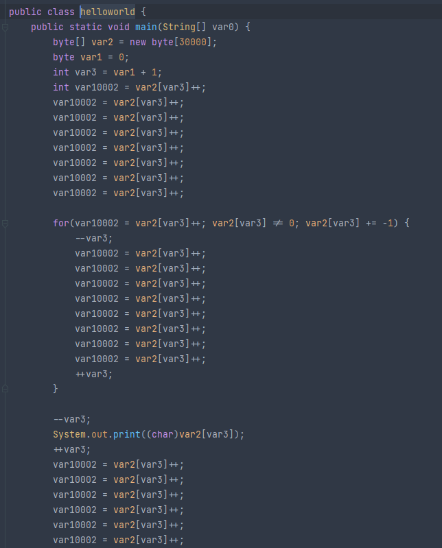

# brainfuck-kt
My wacky implementation of a brainfuck intepreter in Kotlin.
Supports streaming the program, when doing so the program must be terminated with an EOF (Ctrl-D).  
Some example programs can be found [here](samplePrograms).  
Credits to [this guide](https://gist.github.com/roachhd/dce54bec8ba55fb17d3a) for information about brainfuck and examples.  
  
Check out Bf2Jvm.kt for a brainfuck to JVM .class file compiler.
This only supports reading and writing to files. The compiler generates obviously very unoptimized code, and the decompiler then generates even more hell:
